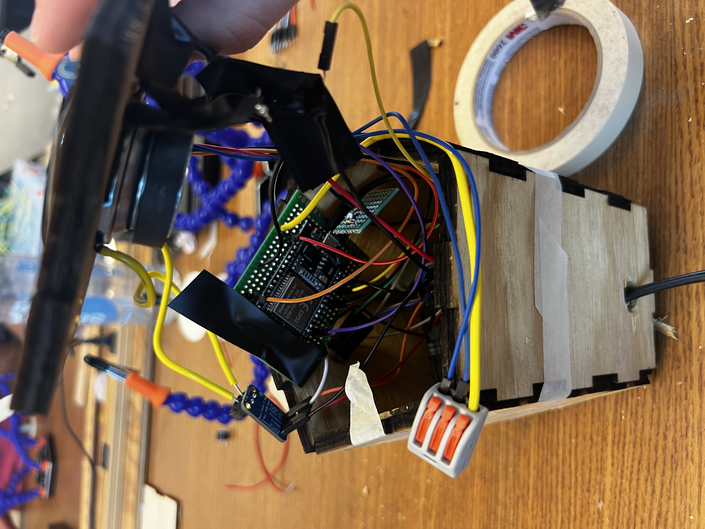
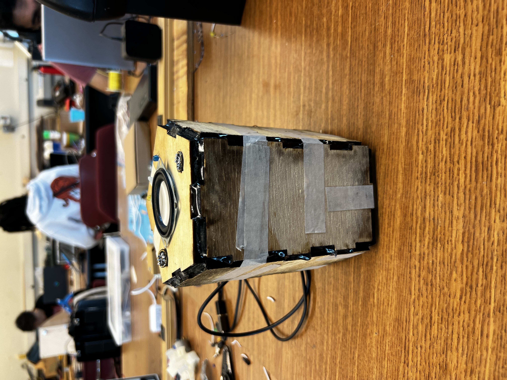

# Marvin's Room(DIY Alexa for Goveee Lights)

Welcome to the repository for "The Cube of Knowledge" - an interactive, voice-controlled device designed to seamlessly integrate with smart home devices, primarily through voice commands. This repository includes all the necessary files and instructions to build and set up your own Cube of Knowledge.

## Project Overview

The Cube of Knowledge is a pentagonal, voice-activated device capable of controlling smart LEDs and other devices through processed voice commands. It uses a custom-trained wake word for activation and processes commands with ESP32 boards. There is more specified information on the specifics of the build in a pdf in the info folder, but this is a solid overview of how to assemble this for yourself. 

## Hardware Requirements

To build the Cube of Knowledge, you'll need the following components:

- 2 x I2S Microphones - [Buy here](https://www.amazon.com/AITRIP-Omnidirectional-Microphone-Precision-Interface/dp/B092HWW4RS/ref=sr_1_3?dib=eyJ2IjoiMSJ9.nuwGj66AyYDYN8x3uaJATiljheUrps2TDD6X6I31jOJiNvgpwVgwmqK4R6Umgc9Ny-VH1ApdaXH-E1LnxCpfzHH9bVLlg9U-tVfZI3cvAaPTk45PlKDcnEE8w3oHYPEqpgae3wKkvZegI5SgkrzfCL-dVpR4pUOeKJvpkbnJi_WJO-k6ufeskPHBgKHEkJ6drbhhUZY-xxWD75JsDkZSIVbhq5Pqjkc-bxLg2c70zqk.gZeI6fZOFf40ZQ2mylPQyn3WrylUGw_DhxvOLGobSLU)
- 2 x ESP32 Dev Boards - [Buy here](https://www.amazon.com/gp/product/B07QCP2451/ref=as_li_tl?ie=UTF8&tag=atomic14-20&camp=1789&creative=9325&linkCode=as2&creativeASIN=B07QCP2451&linkId=2bfe60af5ae9f4be7344703d979cbee7)
- 1 x Speaker - [Buy here](https://www.amazon.com/gp/product/B01CHYIU26/ref=as_li_tl?ie=UTF8&tag=atomic14-20&camp=1789&creative=9325&linkCode=as2&creativeASIN=B01CHYIU26&linkId=9e5849a49e539212c845d785c5764154)
- 1 x PAM8302A Audio Amplifier - [Buy here](https://www.adafruit.com/product/2130)

## Software Setup

### PlatformIO

1. **Install PlatformIO:** Ensure you have PlatformIO installed in your development environment. This will be used for the wake word project.
2. **Clone the Repository:** Clone this repository to your local machine.
3. **Open the Project:** Navigate to the `wake_word` directory and open it with PlatformIO.
4. **Build and Upload:** Compile the code and upload it to the appropriate ESP32 board following the PlatformIO IDE instructions.

### Arduino IDE

1. **Install Arduino IDE:** If not already installed, download and install the Arduino IDE from [Arduino's official website](https://www.arduino.cc/en/software).
2. **Set Up the IDE:**
   - Open Arduino IDE and go to `File` > `Preferences`.
   - Add the ESP32 board to your Arduino IDE by including the following URL in Additional Board Manager URLs: `https://dl.espressif.com/dl/package_esp32_index.json`.
   - Go to `Tools` > `Board` > `Boards Manager`, search for ESP32 and install the latest version.
3. **Load Subfiles:**
   - Open the command_recon.ino file in the command_process subfolder in the Arduino IDE.
   - Set the board to "ESP32 Dev Module" and the firmware version to 1.0.6 under `Tools` > `Board`.
4. **Compile and Upload:** Verify and upload the code to the corresponding ESP32 boards.

## Wiring and Hardware Assembly

Refer to the hardware section of this repository for detailed wiring diagrams and assembly instructions. Ensure all connections are secure and double-check them before powering the device. I will place a hardware diagram in here soon, currently working on one. 

## Project Photos

Below are some images showing various stages of the project development:

*Detailed view of whats inside the box \(yes it is messy\)*

*The completed Cube of Knowledge assembled and operational.*

## Acknowledgements

- **Wake Word Code**: The wake word code was adapted from a YouTube tutorial by [atomic14](https://www.youtube.com/watch?v=re-dSV_a0tM&list=LL&index=3&t=186s). His video provided a solid foundation for the initial wake word detection feature.
- **Speech to Text Base**: The code for converting speech to text was based on a tutorial by [techiesms](https://www.youtube.com/watch?v=VoanFTpCTU4&list=LL&index=2&t=348s). This tutorial helped in setting up the speech processing capabilities of the Cube. 

## Contributions

I am planning to remake this project using a Rasberry Pi and make it a lot more streamlined/faster, along with more deeply integrating Govee Lights. Please reach out to me if you are interested in collaborating on this 

Twitter: @msteele020

## License

This project is released under the MIT License.
